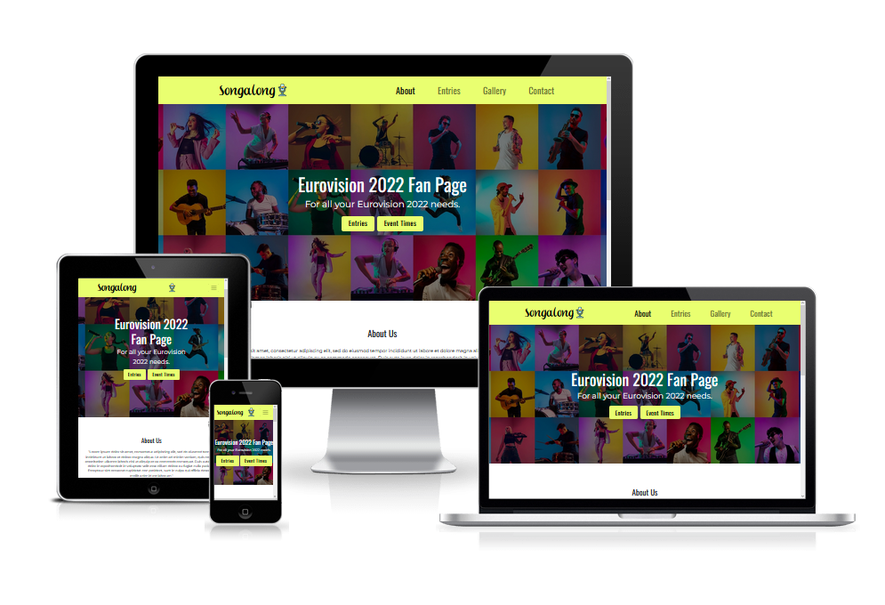
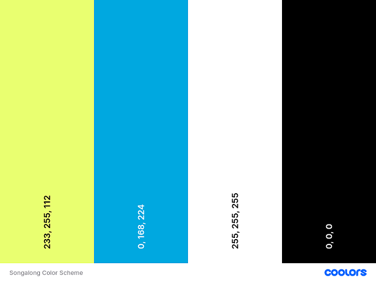
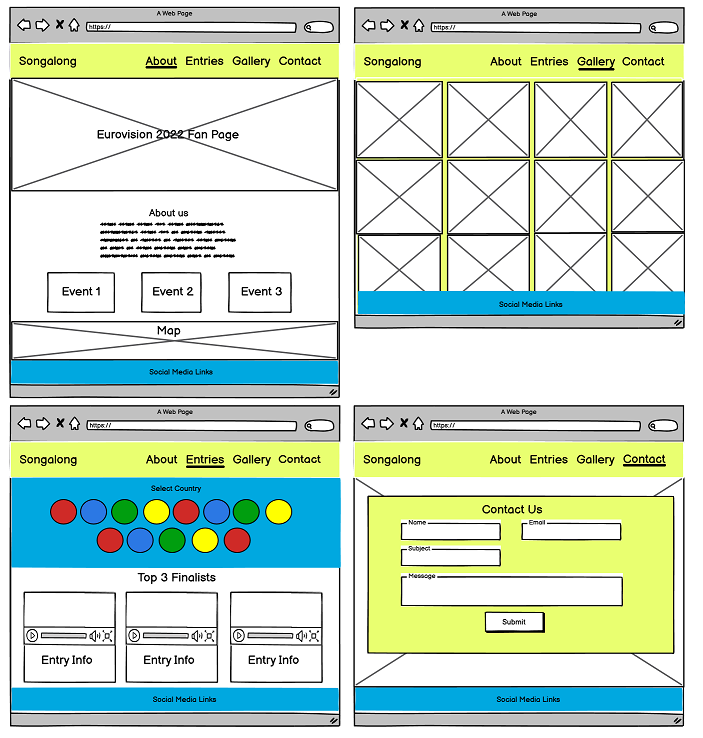
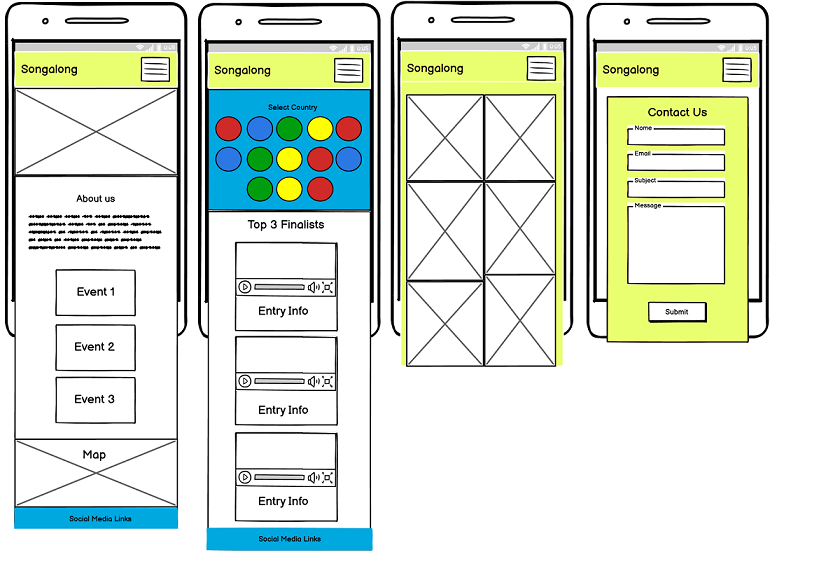
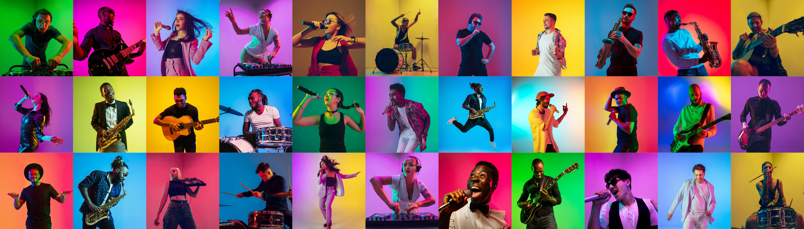
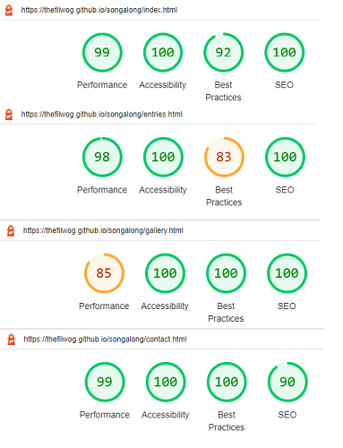

<h1 align="center">Songalong Website</h1>

## Introduction

Songalong is a website dedicated to the 2022 Eurovision Song Contest. The site is intended to act as a source of information for fans of the competition with details on the events, performers and music of the contest. 

The live site can be accessed [here](https://thefilwog.github.io/songalong/)

 
## Design

- __Color Pallete__
    - The two main colours used are Mindaro (HEX #E9FF70) and Cerulean Crayola (HEX #00A8E0). 
    - Mindaro was considered to be the base color which is predominantly seen in the header of the site. 
    - Cerulean Crayola was matched to the base color as the font with highest contrast that complies with Web Content Accessibility Guidelines (WCAG).

      

- __Typography__
    - The Oswald Google font is used in the headings and menu and has sans-serif as the fallback font. It was chosen for it's clean and modern aesthetic.
    - Montserrat is used in the body and considered to be popular sans-serif font. The fallback font is sans-serif.
    - Eurovision Choir 2017 is used in the logo and was obtained from fontspace.com. 

- __Wireframes__
    - Desktop Wireframe
        - The desktop wireframe was designed first to structure the layout of the content and media that was envisaged.

          

    - Mobile Wireframe
        - The mobile wireframe considers the layout for smaller display screens.

          
  

## Features 

This section introduces the features that have been implemented for the website in order to create a seamless experience through quick navigation of content and the ability to contact the site owners.

### Existing Features

- __Navigation Bar__

  - The navigation bar includes the main title (logo) and a page menu to access the 4 main pages. 
  - The logo links the user back to the main content page. This is considered to be best practice as users are accustomed to this behaviour when browsing websites in general.
  - The navigation bar is responsive and has been fixed at the top of the screen for smaller devices. This would allow the user to easily navigate to next page without scrolling back up to the navigation bar. A burger menu is used for mobile devices used in portrait orientation. 

    

- __The Hero Image__

  - The About and Contact pages contain a hero image of a selection of performance artists set amongst coloured tiles. This image was licenced for non-commercial use from Adobe Stock Images. 
  - This image was chosen as it represents the diversity of musical performers in the competition and provides an aesthetic splash of colour to the design. 
  
    

- __About Us Section__

  - The About Us section contains information about the Eurovision Song Contest 2022 with links to the entries and event times. 
  - The user can also view an embedded google map of the Eurovision Song Contest 2022 Venue. 
  - The About Us content paragraph also draws attention to the Contact Us page where the user can provide feedback or submit a query. 

     
 
 
- __Entries Section__

  - This section starts with a display of the National Flag of each competing country presented in a series of circles. These flag icons act as links which will open a new tab to the Youtube Video of that countries entry for 2022. 
  - The top 3 countries are shown below this, with the entry video embedded into the site.
 

     

- __Gallery Section__

  - The Gallery contains high resolution images of the contest and the performers for users to view. 
  - The images are external images loaded from the Eurovision website. 

      

- __The Footer__ 

  - The footer section contains social media links to Facebook, YouTube and Instagram. These links currently take the user to the homepage of each social media site.

      

- __The Contact Page__

  - This page provides the user with the ability to provide feedback or raise a query to the site owners with a clear call to action. 
  - The form is set in a semi-transparent container in Mindaro. 
  - Basic information like name, email, subject and your message is requested to allow the site owners to reply to the user.

    

## Testing 
 - Please see the section that follows for more detail regarding the testing that was completed below:
   - HTML and CSS code
   - Accessibility
   - Mobile responsiveness
   - Browser compatibility

### Validator Testing 

- HTML
  - There  were no errors identified in the site pages [W3C validator](https://validator.w3.org/nu/?doc=https%3A%2F%2Fthefilwog.github.io%2Fsongalong%2Findex.html).
  - The warnings returned referred to headers that were not added to sections where the design intended that headers would be excluded.

- CSS
  - No errors were found in my CSS content but a number of unspecified errors were identified in the Bootstrap library imported. (https://jigsaw.w3.org/css-validator/validator?uri=https%3A%2F%2Fashraafa.github.io%2Four-travels&profile=css3svg&usermedium=all&warning=1&vextwarning=&lang=en).

- Accessibility
  - Scored 100% on all pages. 

- Performance
  - Scored a minimum of 98% on all pages except gallery. The gallery page performs less effectively as the images are high resolution loaded from the official Eurovision site in order to respect the copyright of the images.

- Best Practices
  - Scored a minimum of 92% on all pages with the exception of the entries page which scores lower due to the aspect ratio of the flag images being altered to facilitate the circular icons but this has no impact on their appearance or usability. 

     

- Mobile Responsiveness
  - Minimum screen width for responsive design was done at 320px.
  - Mobile responsiveness was tested using Firefox Developer Tools and Responsive Design Mode to simulate a range of mobile devices. 
  - Responsive design testing on physical devices were done on an iPhone 12 Pro and a Samsung Galaxy S10+.

- Desktop Browser Compatibility
  - Site was tested in the following browsers:
     - Microsoft Edge Version 101.0.1210.53 (Official build) (64-bit)
     - Firefox Version 100.0 (Official build) (64-bit)

### Bugs

There were no known bugs at the time of final deployment. 

## Deployment

The site was deployed to GitHub pages.

- The steps to deploy are as follows: 
  - In the GitHub repository, navigate to the Settings tab.
  - On the left menu list, select Pages.
  - In the source section drop-down menu, select the Main Branch and click Save.
  - Upon successful save, the Github Pages section will display a message to indicate that the site is ready to be published at https://thefilwog.github.io/songalong/index.html

## Credits 

The following section identifies websites and individuals that supported me whilst building the Songalong site.

### Content and Media

- General Guidance 
  - [Code Institute Course Material](https://learn.codeinstitute.net/)
  - Reuben Ferrante - Senior Python Developer for his mentorship regarding best industry practices
  - [Wireframes](https://balsamiq.com/)
  - [HTML References](https://www.w3schools.com/html/)
  - [CSS References](https://www.w3schools.com/css/)
  - [General Challenges with CSS](https://stackoverflow.com/)
  - [Icons](https://fontawesome.com/)
  - [Fonts](https://fonts.google.com/)
  - [Color Pallettes and Contrast Checker](https://coolors.co/)
  - [Image to WebP format conversion](https://www.convertio.co)
  - [Images](https://stock.adobe.com/)
  - [Gallery Images](https://eurovision.tv/)
  - [Videos](https://www.youtube.com/)
  - [Maps](https://maps.google.com/)
  - [CSS Styling](https://getbootstrap.com/)
  - [Logo Font](https://www.fontspace.com/)
